# SaptaWork

<p align="center">
  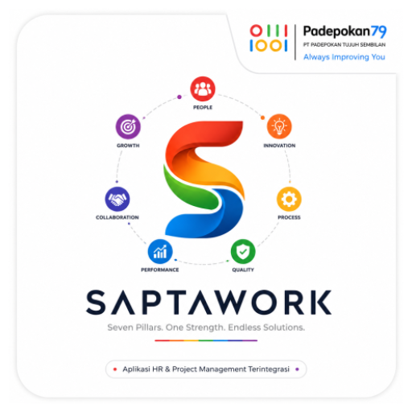
</p>

<p align="center">
  <strong>Aplikasi Android Native Kotlin untuk absensi, working report, izin, lembur, dan monitoring operasional karyawan.</strong>
</p>

<p align="center">
  
  
  
  
  
</p>

SaptaWork adalah aplikasi mobile internal yang dirancang untuk membantu proses operasional karyawan di lingkungan Padepokan Tujuh Sembilan. Aplikasi ini menggabungkan fitur absensi berbasis kamera, validasi lokasi kantor, working report harian, pengajuan izin, pengajuan lembur, notifikasi aktivitas, serta dashboard monitoring untuk Human Capital (HC).

Repository ini disusun untuk memenuhi ketentuan UAS Pemrograman Mobile 1 dengan format pengumpulan yang rapi, profesional, dan mudah diperiksa langsung dari GitHub.

---

## Daftar Isi

* [Ringkasan Project](#ringkasan-project)
* [Fitur Utama](#fitur-utama)
* [Peran Pengguna](#peran-pengguna)
* [Alur Aplikasi](#alur-aplikasi)
* [Screenshot Aplikasi](#screenshot-aplikasi)
* [Teknologi yang Digunakan](#teknologi-yang-digunakan)
* [Struktur Repository](#struktur-repository)
* [Struktur Kode](#struktur-kode)
* [Cara Menjalankan Project](#cara-menjalankan-project)
* [Akun Demo Cepat](#akun-demo-cepat)
* [Artefak Pengumpulan UAS](#artefak-pengumpulan-uas)
* [Link Video Penjelasan](#link-video-penjelasan)
* [Anggota Kelompok](#anggota-kelompok)
* [Catatan Penting](#catatan-penting)

---

## Ringkasan Project

SaptaWork dibangun menggunakan **Android Native Kotlin** dan tetap memakai komponen Android asli seperti **Activity**, **Fragment**, **Intent**, **ViewBinding**, serta **Jetpack Compose** untuk antarmuka modern. Dari sisi pengguna, aplikasi dibagi menjadi dua alur utama:

* **Karyawan**: login, absen masuk/pulang, mengirim working report, mengajukan izin, melihat riwayat, melihat notifikasi, dan mengajukan lembur.
* **Human Capital (HC)**: memantau presensi seluruh karyawan, menyetujui izin, meninjau laporan kerja, memverifikasi lembur, serta melihat statistik sistem.

Backend utama menggunakan **Firebase Authentication**, **Cloud Firestore**, dan **Firebase Storage** untuk menyimpan akun, data operasional, bukti absensi, dan dokumen pendukung.

---

## Fitur Utama

* **Autentikasi Login** menggunakan NIP atau email dan password.
* **Role-Based Dashboard** terpisah untuk Karyawan dan HC.
* **Absensi Masuk dan Pulang** dengan kamera serta bukti foto.
* **Validasi Radius Kantor** untuk memastikan absensi dilakukan dari lokasi yang diizinkan.
* **Working Report Harian** untuk mencatat aktivitas kerja dan progres.
* **Pengajuan Izin / Sakit / Cuti** dengan alur persetujuan oleh HC.
* **Pengajuan dan Approval Lembur** lengkap dengan riwayat status.
* **Riwayat Absensi dan Izin** dalam tampilan ringkasan dan histori detail.
* **Notifikasi Aktivitas** seperti login berhasil dan update status pengajuan.
* **Monitoring Presensi HC** untuk memeriksa status kehadiran seluruh karyawan.
* **Statistik Sistem** untuk menampilkan data operasional secara ringkas.
* **Pengaturan Profil dan Tema** termasuk mode gelap/terang.

---

## Peran Pengguna

| Role | Akses Utama |
|---|---|
| Karyawan | Login, absensi, working report, izin, riwayat, notifikasi, profil, lembur |
| HC / Admin | Dashboard monitoring, approval izin, approval laporan, approval lembur, statistik, monitoring presensi |

---

## Alur Aplikasi

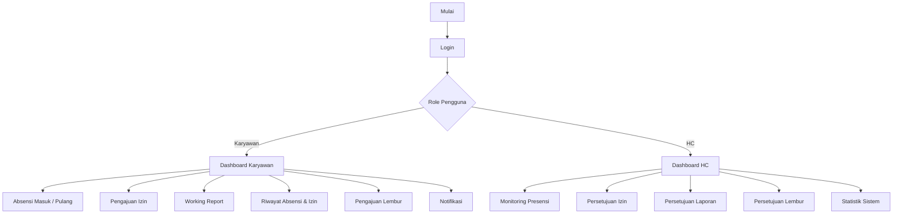

---

## Screenshot Aplikasi

### 1. Halaman Login

Antarmuka autentikasi awal untuk masuk menggunakan NIP/email dan password.

<p align="center">
  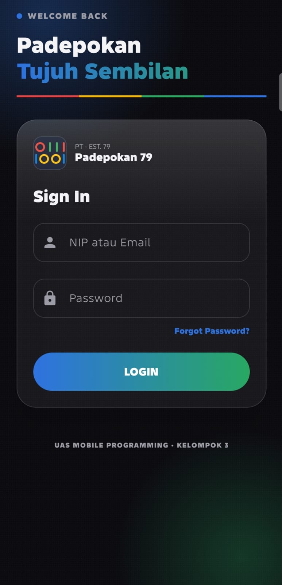
</p>

### 2. Dashboard Karyawan

Halaman utama karyawan yang menampilkan status absensi hari ini, shortcut fitur utama, dan riwayat terbaru.

<p align="center">
  
</p>

### 3. Riwayat Absensi dan Izin

Menampilkan statistik singkat kehadiran, kalender histori, dan daftar status absensi per tanggal.

<p align="center">
  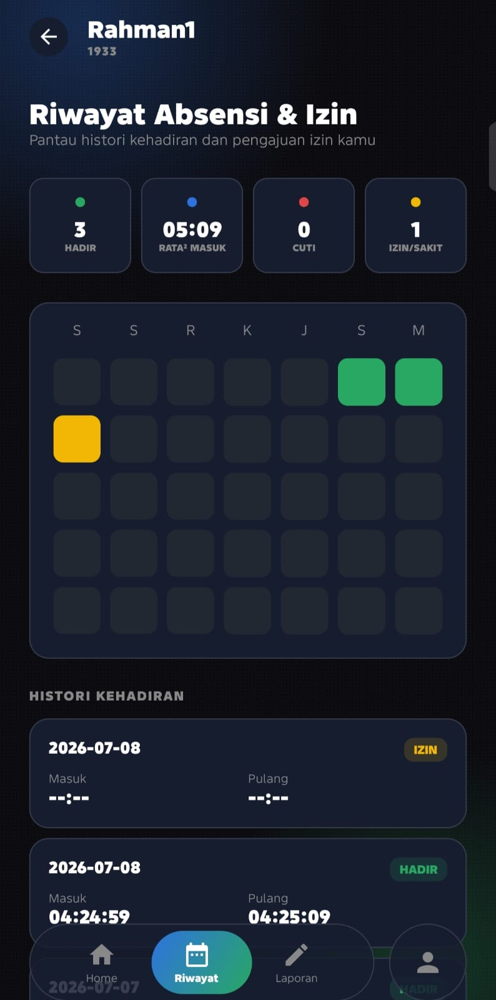
</p>

### 4. Working Report Karyawan

Daftar laporan kerja yang telah dikirim lengkap dengan status seperti `APPROVED` dan `REVISION`.

<p align="center">
  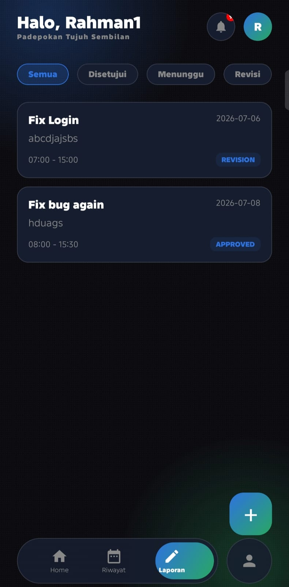
</p>

### 5. Pengajuan dan Riwayat Lembur

Karyawan dapat membuat pengajuan lembur dan memantau status seluruh riwayat pengajuan.

<p align="center">
  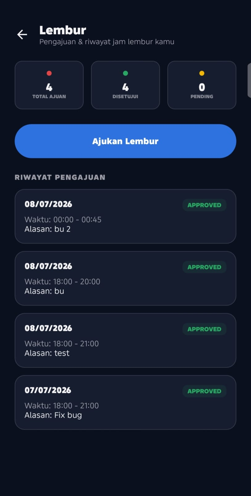
</p>

### 6. Notifikasi Aktivitas

Halaman notifikasi untuk menampilkan aktivitas penting seperti status login atau perubahan data.

<p align="center">
  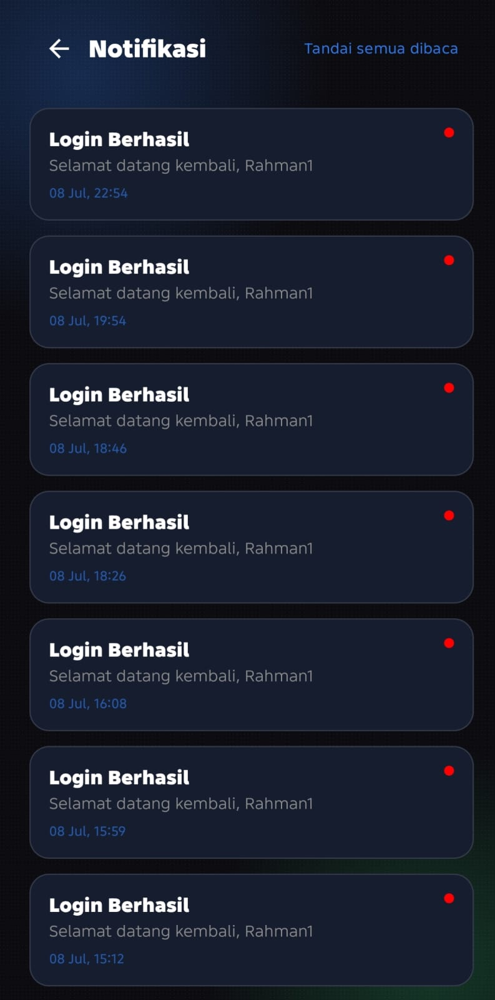
</p>

### 7. Monitoring Presensi HC

HC dapat memantau seluruh data presensi karyawan, lengkap dengan pencarian dan filter status.

<p align="center">
  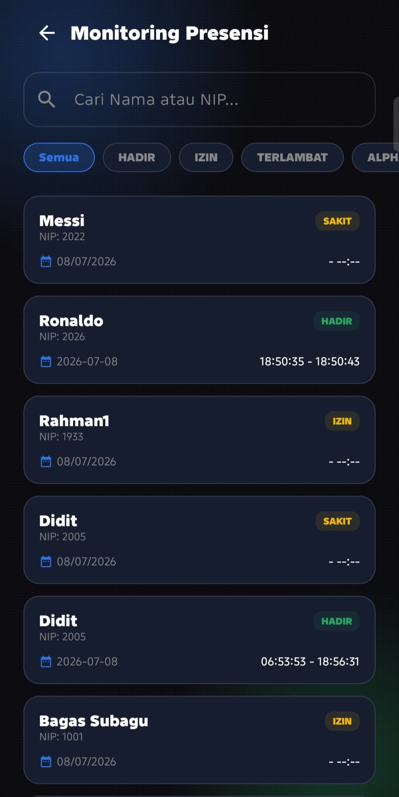
</p>

### 8. Persetujuan Izin

Halaman persetujuan izin untuk memeriksa dan menyetujui pengajuan karyawan.

<p align="center">
  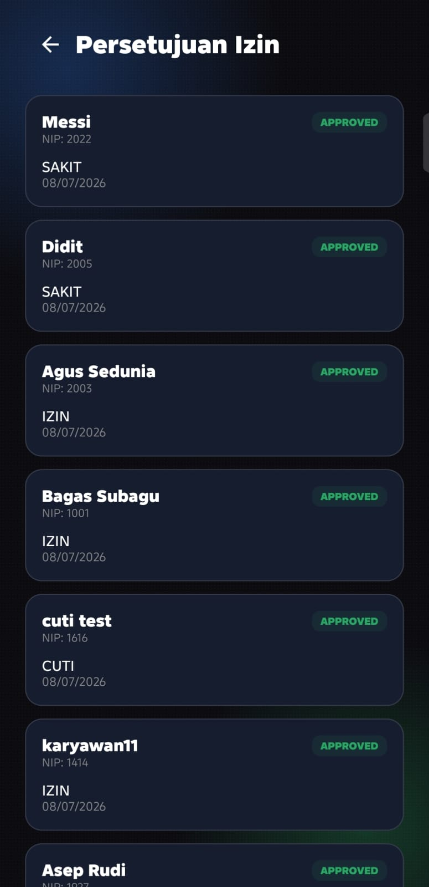
</p>

### 9. Persetujuan Laporan

HC dapat meninjau working report, melakukan pencarian, serta memfilter laporan berdasarkan status.

<p align="center">
  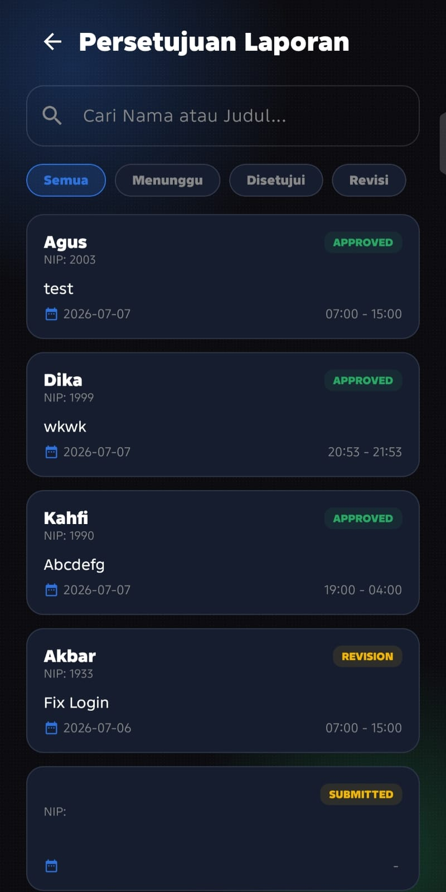
</p>

### 10. Profil Admin dan Statistik Sistem

Bagian profil menyediakan pengaturan akun dan akses cepat ke halaman statistik sistem.

<p align="center">
  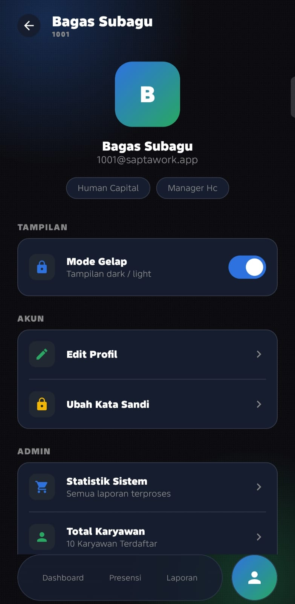
  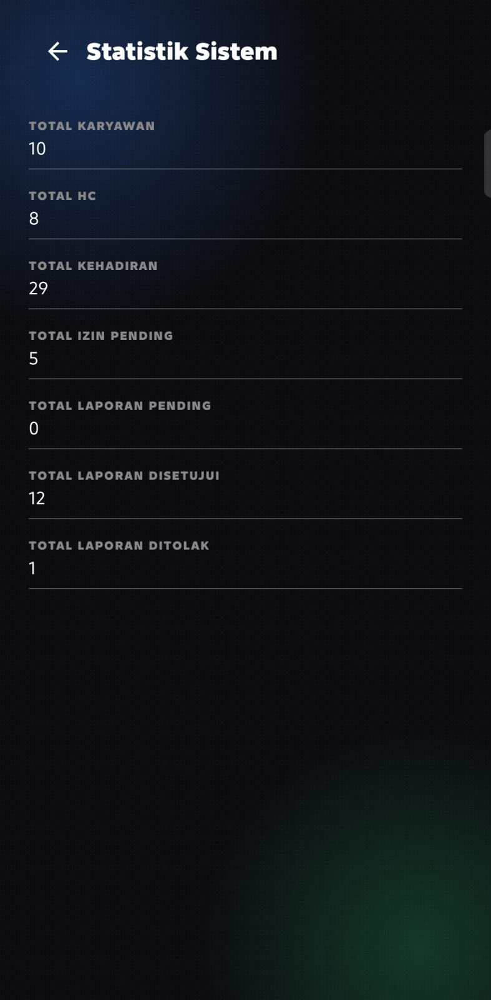
</p>

---

## Teknologi yang Digunakan

* **Bahasa Pemrograman**: Kotlin
* **Platform**: Android Native
* **Arsitektur UI**: Activity, Fragment, Intent, ViewBinding, Jetpack Compose
* **Backend**: Firebase Authentication, Cloud Firestore, Firebase Storage
* **Camera**: CameraX
* **Concurrency**: Kotlin Coroutines
* **Build System**: Gradle Kotlin DSL
* **SDK**: `minSdk 26`, `targetSdk 34`, `compileSdk 36`

---

## Struktur Repository

```text
finalproject/
|-- app/
|-- apk/
|   |-- sapta-work-debug.apk
|   `-- sapta-work-release.apk
|-- docs/
|   |-- ooad/
|   |   |-- LaporanOOAD_Kel3_TIFRP24DCNS_Final1_compressed (1).pdf
|   |   `-- README.md
|   |-- reference/
|   |   `-- soal-uas-mobile-programming-1.pdf
|   `-- screenshots/
|       |-- admin/
|       `-- employee/
|-- gradle/
|-- README.md
|-- build.gradle.kts
`-- settings.gradle.kts
```

---

## Struktur Kode

```text
app/src/main/java/com/feisal/workingreport/
|-- model/
|   |-- Attendance.kt
|   |-- PermissionRequest.kt
|   |-- User.kt
|   `-- WorkingReport.kt
|-- repository/
|   |-- AttendanceRepository.kt
|   |-- AuthRepository.kt
|   |-- NotificationRepository.kt
|   |-- PermissionRepository.kt
|   `-- WorkingReportRepository.kt
|-- service/
|   `-- StorageService.kt
|-- ui/
|   |-- components/
|   `-- theme/
|-- utils/
|   |-- Constants.kt
|   |-- DateHelper.kt
|   `-- LocationHelper.kt
|-- LoginActivity.kt
|-- DashboardEmployeeActivity.kt
|-- DashboardHCActivity.kt
|-- CameraAbsenActivity.kt
|-- RiwayatSayaActivity.kt
|-- NotificationActivity.kt
|-- ApprovalIzinActivity.kt
|-- ApprovalLaporanActivity.kt
|-- ApprovalLemburActivity.kt
`-- StatisticsActivity.kt
```

Struktur ini dipertahankan agar source code tetap stabil untuk build, sementara dokumentasi repository dibuat lebih rapi untuk kebutuhan penilaian UAS. Package utama aplikasi tetap menggunakan `com.feisal.workingreport`.

---

## Cara Menjalankan Project

### 1. Clone Repository

```bash
git clone <UAS-Mobile-Programming-Kelompok3>
cd UAS-Mobile-Programming-Kelompok3
```

### 2. Prasyarat

* Android Studio versi terbaru
* JDK 11
* Android SDK sesuai konfigurasi project
* Perangkat Android atau emulator dengan minimal Android 8.0 (API 26)
* Koneksi internet untuk fitur Firebase

### 3. Jalankan Project

1. Buka folder project di Android Studio.
2. Tunggu proses **Gradle Sync** hingga selesai.
3. Pastikan file `app/google-services.json` tersedia.
4. Jalankan aplikasi pada emulator atau perangkat fisik.
5. Izinkan akses **kamera**, **lokasi**, dan **media** saat aplikasi meminta permission.

---

## Akun Demo Cepat

Untuk demo lokal atau ketika koneksi Firebase tidak tersedia, aplikasi menyediakan fallback login berikut:

| Role | NIP | Password |
|---|---|---|
| HC | `1001` | `123123123` |
| Karyawan | `1993` | `rahman21` |

---

## Artefak Pengumpulan UAS

Berikut struktur artefak yang sudah disiapkan sesuai ketentuan soal:

* **Source code Android Studio** tersedia di folder `app/`
* **APK release** tersedia di [apk/sapta-work-release.apk](apk/sapta-work-release.apk)
* **APK debug** tersedia di [apk/sapta-work-debug.apk](apk/sapta-work-debug.apk)
* **Screenshot aplikasi** tersedia di `docs/screenshots/`
* **PDF acuan soal UAS** tersedia di [docs/reference/soal-uas-mobile-programming-1.pdf](docs/reference/soal-uas-mobile-programming-1.pdf)
* **Laporan OOAD final** tersedia di [docs/ooad/LaporanOOAD_Kel3_TIFRP24DCNS_Final1_compressed (1).pdf](<docs/ooad/LaporanOOAD_Kel3_TIFRP24DCNS_Final1_compressed (1).pdf>)

---

## Link Video Penjelasan

Ketentuan UAS mewajibkan link video penjelasan project dicantumkan di README. Ganti placeholder berikut dengan link final kelompok sebelum submit:

```text
https://youtu.be/REPLACE_WITH_FINAL_DEMO
```

Isi video minimal mencakup:

* Perkenalan semua anggota kelompok
* Demo seluruh fitur aplikasi
* Penjelasan singkat alur kode atau implementasi fitur utama

---

## Anggota Kelompok

| Nama | NIM / NPM | Peran |
|---|---|---|
| Muhamad Arga Reksapati | 24552011324 | Backend / Testing |
| Feisal Ramdhani Riyadi | 24552011317 | UI UX / Frontend |
| Diky Raihan Subagja | 24552011194 | Frontend / UI Support |
| Dafa Irsyad Nasrullah | 24552011306 | Bacend / Firebase Integration |

---

## Catatan Penting

* README ini disusun menyesuaikan ketentuan UAS Pemrograman Mobile 1 tanggal **09 Juli 2026**.
* File laporan OOAD final saat ini disimpan di folder `docs/ooad/` agar struktur repository tetap konsisten dan mudah diperiksa.
* Nama aplikasi yang ditampilkan ke pengguna adalah **SaptaWork**, sementara package utama source code tetap `com.feisal.workingreport` untuk menjaga kestabilan konfigurasi project.
