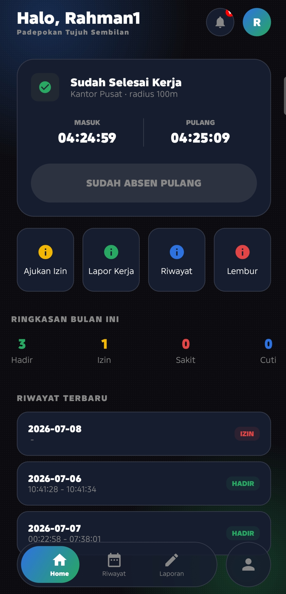
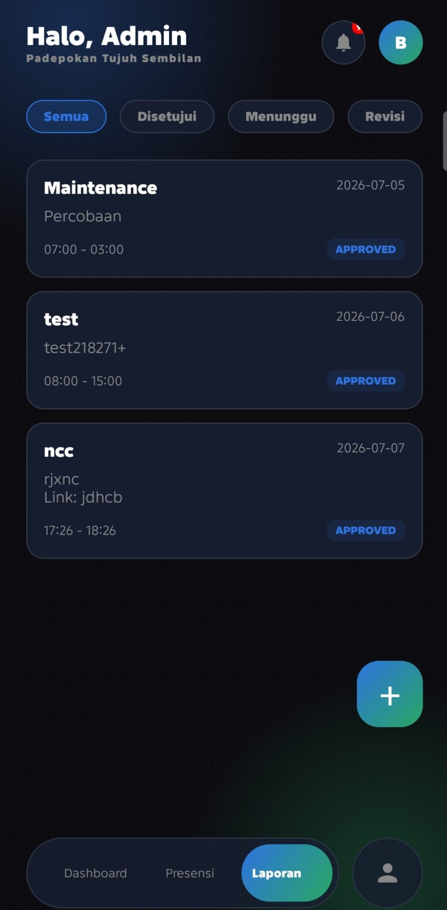

# Sapta Work

<p align="center">
  
</p>

<p align="center">
  
  
  
  
</p>

Sapta Work adalah aplikasi Android Native Kotlin untuk mendukung proses absensi karyawan, working report harian, pengajuan izin, dan pemantauan aktivitas oleh Human Capital. Proyek ini disusun sebagai aplikasi UAS Mobile Programming Kelompok 3 dengan fokus pada aplikasi yang stabil, mudah didemokan, dan siap dikumpulkan sebagai repository Android Studio yang lengkap.

## Daftar Isi

* [Tentang Sapta Work](#tentang-sapta-work)
* [Fitur Utama](#fitur-utama)
* [Peran Pengguna](#peran-pengguna)
* [Penjelasan Antarmuka](#penjelasan-antarmuka)
* [Teknologi yang Digunakan](#teknologi-yang-digunakan)
* [Struktur Repository](#struktur-repository)
* [Cara Menjalankan](#cara-menjalankan)
* [Akun Demo Offline](#akun-demo-offline)
* [Build APK](#build-apk)
* [Artefak Submission UAS](#artefak-submission-uas)
* [Anggota Kelompok](#anggota-kelompok)

## Tentang Sapta Work

Sapta Work dirancang untuk membantu perusahaan mengelola proses kehadiran dan pelaporan kerja dalam satu aplikasi mobile. Karyawan dapat melakukan login, absen masuk dan pulang menggunakan kamera, mengirim laporan kerja, mengajukan izin, dan melihat riwayat aktivitas. Sementara itu, pihak HC dapat memantau data, membuka mode admin, serta meninjau aktivitas yang masuk dari sisi operasional.

Repository ini tetap mempertahankan package utama `com.feisal.workingreport` agar aman untuk build dan demo. Perapihan difokuskan pada struktur submission, dokumentasi, dan artefak repo tanpa melakukan refactor besar yang berisiko merusak aplikasi.

## Fitur Utama

* Login menggunakan NIP dan password
* Role terpisah untuk HC dan Karyawan
* Absensi masuk dan pulang menggunakan kamera
* Validasi lokasi kantor untuk proses absensi
* Working report harian untuk pelaporan aktivitas kerja
* Pengajuan izin dengan data pendukung
* Pengajuan dan riwayat lembur
* Riwayat absensi dan aktivitas pengguna
* Dashboard admin HC untuk monitoring data
* Notifikasi aktivitas login dan status data

## Peran Pengguna

| Role | Fungsi Utama |
|---|---|
| Karyawan | Login, absen masuk/pulang, kirim working report, ajukan izin, lihat riwayat, kelola profil |
| HC / Admin | Monitoring data, membuka dashboard admin, meninjau laporan, melihat data operasional, mengakses mode pengawasan |

## Penjelasan Antarmuka

### 1. Halaman Login

Halaman autentikasi untuk pengguna menggunakan NIP dan password sebelum masuk ke dashboard sesuai role.

<p align="center">
  
</p>

### 2. Dashboard Karyawan

Dashboard utama karyawan menampilkan status absensi, ringkasan kehadiran, akses cepat ke izin, laporan kerja, riwayat, dan lembur.

<p align="center">
  
</p>

### 3. Dashboard Admin / HC

Tampilan admin digunakan untuk memantau data operasional dan aktivitas yang memerlukan peninjauan dari sisi HC.

<p align="center">
  
</p>

## Teknologi yang Digunakan

* Bahasa pemrograman: Kotlin
* Platform: Android Native
* Backend: Firebase Authentication, Cloud Firestore, Firebase Storage
* Camera: CameraX
* UI: Jetpack Compose, ViewBinding, Activity, Fragment, Intent
* Build System: Gradle Kotlin DSL

## Struktur Repository

```text
UAS-Mobile-Programming-Kelompok3/
|-- app/
|-- apk/
|   |-- sapta-work-debug.apk
|   `-- sapta-work-release.apk
|-- docs/
|   |-- Laporan_OOAD_Sapta_Work.pdf
|   `-- screenshots/
|       |-- login.jpg
|       |-- dashboard-karyawan.jpg
|       `-- dashboard-admin.jpg
|-- README.md
|-- build.gradle.kts
|-- settings.gradle.kts
`-- gradle/
```

## Cara Menjalankan

```bash
git clone https://github.com/tridentmobile3/UAS-Mobile-Programming-Kelompok3.git
cd UAS-Mobile-Programming-Kelompok3
```

Langkah menjalankan project:

1. Buka project dengan Android Studio.
2. Tunggu proses Gradle Sync selesai.
3. Jalankan aplikasi pada emulator atau perangkat Android.
4. Berikan izin kamera dan lokasi saat diminta.

Prasyarat minimum:

* Android Studio terbaru
* Android SDK sesuai konfigurasi project
* Device atau emulator Android dengan `minSdk 26`

## Akun Demo Offline

Jika Firebase belum terhubung atau ingin melakukan demo cepat, aplikasi menyediakan fallback login offline berikut:

| Role | NIP | Password |
|---|---|---|
| HC | `1234` | `1234` |
| Karyawan | `12345678` | `12345678` |

## Build APK

```bash
gradlew.bat clean :app:assembleDebug
copy app\build\outputs\apk\debug\app-debug.apk apk\sapta-work-debug.apk

gradlew.bat :app:assembleRelease
```

APK submission yang sudah disiapkan di repository:

* Debug: [apk/sapta-work-debug.apk](apk/sapta-work-debug.apk)
* Release: [apk/sapta-work-release.apk](apk/sapta-work-release.apk)

## Artefak Submission UAS

Checklist repository:

* Source code Android Studio tersedia di folder `app/`
* APK debug dan release tersedia di folder `apk/`
* Laporan OOAD tersedia di [docs/Laporan_OOAD_Sapta_Work.pdf](docs/Laporan_OOAD_Sapta_Work.pdf)
* Screenshot tampilan aplikasi tersedia di `docs/screenshots/`
* README sudah menjelaskan aplikasi, fitur, screenshot, dan cara menjalankan project
* Link video demo masih perlu diganti dengan link final tim

Link video demo:

```text
https://youtu.be/REPLACE_WITH_FINAL_DEMO
```

Catatan:

* File PDF OOAD yang ada saat ini masih placeholder struktur dan perlu diganti dengan laporan final tim.
* Package utama project tetap `com.feisal.workingreport` agar aman untuk build dan demo.

## Anggota Kelompok

| Nama | NIM | Peran |
|---|---|---|
| Muhamad Arga Reksapati | 24552011324 | Backend / Firebase Integration |
| Feisal Ramdhani Riyadi | 24552011317 | UI / Frontend |
| Diky Raihan Subagja | 24552011194 | Admin Page / UI Support |
| Dafa Irsyad Nasrullah | 24552011306 | Testing / Documentation |
